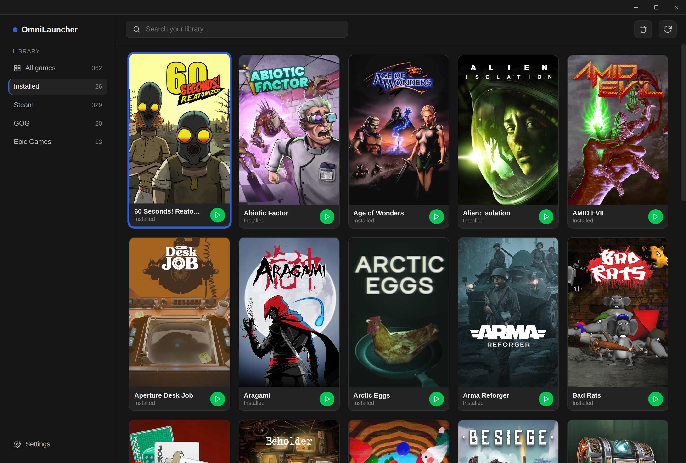

<p align="center">
  
</p>

<h1 align="center">OmniLauncher</h1>

<p align="center">A third party open source game launcher for Linux.</p>


OmniLauncher brings your Steam, GOG, Epic Games, and Amazon Games libraries together in a
single, unified interface. It doesn't replace those clients — it drives them: Steam directly,
and GOG/Epic/Amazon through [Heroic Games Launcher](https://heroicgameslauncher.com/)'s bundled
backends (`gogdl`, `legendary`, `nile`).

## Features

- **One library, every store** — Steam, GOG, Epic, and Amazon games in a single grid, filterable
  by store or installed status.

- **NFC tag launching** — write a game to a physical NFC tag with a PN532 USB reader, then tap it
  to launch that game instantly. Handy for a couch/arcade-cabinet setup where digging through a
  menu isn't the point. Tested with a PN532 USB reader
  ([Amazon](https://www.amazon.com/dp/B0DKTK9VS9), [eBay](https://www.ebay.com/itm/198168802345)).

- **Install, launch, and uninstall from one place** — no store client window getting in the way.
  Confirmation dialogs Steam requires (install/uninstall) are handled and backgrounded
  automatically once they're no longer needed.

- **In-app store login** — log in to GOG, Epic, and Amazon without leaving the app; the
  authorization code is captured automatically, no copy-pasting required. Steam login stays in
  the Steam client itself, where it actually lives.

- **Cover art** — fetched from [SteamGridDB](https://www.steamgriddb.com/) and cached locally, so
  art never depends on a live connection to the store's own CDN.

- **Controller-first navigation** — full gamepad support with D-pad/stick navigation, shoulder
  buttons to cycle library tabs, and automatic input lockout while a game is running so a
  controller input never accidentally lands on the launcher instead of your game.

- **TV-friendly UI scaling** — a display scale setting for couch/TV use, independent of your
  desktop's own scaling.

- **Big Picture mode** — a fullscreen, controller-first view modelled on Steam's Big Picture:
  library tabs on L1/R1, a capsule grid, a game page with Play/Install, and a button legend.
  Start / F11 / the TV icon toggles it; it can also open automatically at launch.

- **Steam-style Downloads page** — current download with live speed, peak, time remaining and
  a network graph, plus a queue (one download at a time) and a completed list. Downloads
  started in Steam directly show up here too.

- **Install/uninstall detection** — games installed or removed in Steam or Heroic appear or
  disappear automatically, no manual rescan.

- **Per-game options** (right-click or Y) — install/uninstall, choose the Proton version
  (Steam games and GOG/Epic/Amazon Windows games), cover art, NFC tag.

- **Each store through its own client** — Steam games always launch through Steam; GOG,
  Epic and Amazon games always launch through Heroic, headless (no Heroic window). Steam is
  only started when a Steam game is installed, uninstalled or played.

- **Seamless Steam** — Steam runs in the background with no windows; install prompts, EULAs,
  uninstall confirmations and pre-launch dialogs are answered automatically. This uses Steam's own client API, which
  needs Steam's remote debugging switched on (the same switch Decky Loader uses).
  OmniLauncher turns it on itself on any distro: it creates the empty
  `.cef-enable-remote-debugging` file in your Steam folder (native, Debian/Ubuntu, Snap or
  Flatpak Steam), and if Steam was already running without it, restarts Steam once in the
  background (never while a Steam game is running). Note that any local program can then
  control Steam through `localhost:8080`; delete that file and restart Steam to turn it off.

- **Built-in Steam Input for non-Steam games** — OmniLauncher's own controller layer
  (`resources/omni_input.py`) runs Steam Input's actual templates without Steam: pick
  **Gamepad** or **Keyboard (WASD) and Mouse** per game from the options menu (Y). Games
  without controller support default to WASD and Mouse. Works with generic pads (8BitDo,
  etc.) and the Steam Controller — both the 2026 model and the original — over hidraw, with
  trackpads, back buttons and rumble. Needs `python3-evdev` and access to `/dev/uinput` and
  the controllers. If anything is missing (Bazzite/SteamOS have it all, most distros don't),
  OmniLauncher offers to set it up once at startup — one admin password prompt that installs
  `python3-evdev` with your package manager (dnf, apt, pacman, zypper, xbps, eopkg), adds
  a udev rule, and loads the Xbox controller driver (`xpad`) - on Fedora-based distros that
  means installing `kernel-modules-extra`, which may need a reboot — and again from **Settings → Controllers → Set up**.

- **Full controller support in the UI** — Xbox/PlayStation/generic pads and the Steam
  Controller drive the whole UI, including bumpers, cover-art picking and game options.

- **Game-running lock** — while a game is running (from Steam, Heroic or OmniLauncher) the
  launcher shows the game's title and ignores input, so controller presses never land on it.

## Installation

Download the latest AppImage from the Releases page, make it executable, and run it:

```bash
chmod +x OmniLauncher-*.AppImage
./OmniLauncher-*.AppImage
```

## Building from source

```bash
npm install
npm run build:linux
```

The AppImage is written to `dist/`.

## Development

```bash
npm install
npm run dev
```

## How it works

OmniLauncher detects your installed clients and their libraries by reading the same local files
Steam and Heroic themselves use — `appmanifest_*.acf` for Steam, and Heroic's own cache/config
directories for GOG/Epic/Amazon. Installs, launches, and uninstalls are dispatched through each
store's real CLI or URI scheme; nothing is scraped, reverse-engineered, or run through an
unofficial API. Your credentials for GOG, Epic, and Amazon never pass through OmniLauncher — the
in-app login flow is a normal browser-based OAuth login rendered in an app-controlled window, the
same as any other Electron app that embeds a login page.

## Disclaimer

OmniLauncher is an independent, unofficial project and is not affiliated with, endorsed by, or
associated with Valve, GOG, Epic Games, Amazon, or Heroic Games Launcher. All product names,
logos, and brands referenced belong to their respective owners.
